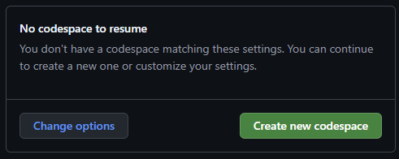

# AI Coding Workshop

---

## Instructions for participants

Welcome! Follow these steps in order. If you get stuck, raise your hand.

### 1. Click "Open in GitHub Codespaces".

<a href="https://codespaces.new/msblei/AI_coding_workshop?quickstart=1" target="_blank">
  
</a>

This opens a new page, log in with your GitHub account (if not already logged in) and then click "Create new codespace".



After this, these instructions will be availble inside the new page, so don't worry about closing this page.

### 2. Find the robot icon.

On the **left side of the screen**, look for the icon that looks like a small robot. Click it. A panel opens on the side.

### 3. Paste the key you were given.

The workshop leaders handed you a key — a long string of letters and numbers. Paste it into the box in the panel, then click "Save". You should now see a chat box.

### 4. Send this message to the robot:

> Build me a flashcard study app in this React project. I should be able to flip cards and go to the next one.

### 5. Watch what happens.

The robot writes code by itself. You don't have to do anything. It might take a minute or two. Files will appear on the left.

### 6. Try your app.

A new browser tab opens with your app inside it. Click around. **What works? What's broken? What's silly?**

### 7. Share your link.

When your codespace finished setting up, a **Welcome** message printed at the bottom of the screen with your live URL. It looks like `https://something-3000.app.github.dev`. Copy it.

(If you can't find the welcome message, the same URL is shown in the **Ports** tab at the bottom of the screen, or in the address bar of the browser tab where your app is running.)

Now paste your name and the URL into the workshop submission doc:

👉 **[Workshop submission doc](https://docs.google.com/document/d/1cgWG_Foie4dn7LOJ9J-9Qep2sB2R1cD0maejTJbVMjY/edit?usp=sharing)**

Example line to paste: `Marius — https://abc123-3000.app.github.dev`

### 8. Wait for the next exercise.

The workshop leaders will introduce a new way to work with the robot. We'll build a second app, but smarter this time.

---

## Instructions for instructors

Everything below this line is for the people running the workshop.

### Repo layout

| File / dir                        | Purpose                                                                                                                                                                                                                                                                    |
| --------------------------------- | -------------------------------------------------------------------------------------------------------------------------------------------------------------------------------------------------------------------------------------------------------------------------- |
| `workshop.config.json`            | Single source of truth: submit URL, LiteLLM base URL, model. Edit per workshop instance.                                                                                                                                                                                   |
| `.devcontainer/devcontainer.json` | Preinstalls Cline, installs `jq`, runs the seed + welcome scripts.                                                                                                                                                                                                         |
| `scripts/seed-cline-settings.sh`  | On `postCreate`, reads `workshop.config.json` and writes `.vscode/settings.json` so Cline opens pre-pointed at your LiteLLM proxy.                                                                                                                                         |
| `scripts/welcome.sh`              | Terminal banner on every attach: live URL, submit doc, example paste line. This IS the share screen — participants don't run any command, they just read it.                                                                                                               |
| `.vscode/tasks.json`              | Auto-starts `npm start` in a dedicated terminal tab when the workspace opens. Combined with `task.allowAutomaticTasks: "on"`, this means the dev server is up by the time the participant reads the welcome banner.                                                        |
| `scripts/reset-app.sh`            | What `npm run reset-app` calls. Restores `src/App.js` and `src/App.css` to the blank starter (inlined in the script), removes any `architecture.md` / `todo.md` leftover, and re-applies the browser tab title.                                                            |
| `scripts/set-title.sh`            | Sets `<title>` in `public/index.html` to the participant's name so each browser tab in the showcase grid is labeled. Runs on `postCreate`. Falls back through `$WORKSHOP_PARTICIPANT_NAME` → `git config user.name` → `$GITHUB_USER` → `$CODESPACE_NAME` → "Workshop App". |
| `scripts/mint-keys.sh`            | **Organizer-only.** Mints N LiteLLM virtual keys from a `participants.txt` list. Prints CSV.                                                                                                                                                                               |

### Workshop flow (120 min)

| Block                       | Time    | Activity                                                                                                                                                                                                                                                                       |
| --------------------------- | ------- | ------------------------------------------------------------------------------------------------------------------------------------------------------------------------------------------------------------------------------------------------------------------------------ |
| **A. Setup**                | 0–15    | "Click the badge" slide. Participants open Codespace, paste key, dev server auto-starts, see the "Hello, workshop!" page and the welcome banner with their URL.                                                                                                                |
| **B. Vibe round**           | 15–45   | Slide intro to Cline's Plan/Act toggle (set to **Act** for this round). Exercise 1 prompt — see below. Participants iterate freely. Remind them their URL is in the welcome banner. Expected: messy half-working apps.                                                         |
| **C. Showcase + diagnosis** | 45–60   | Click through 5–8 submissions live. Discussion: "What's broken? Why?" Land the takeaway: vibe coding produces _something_ but structure rots fast as features pile on.                                                                                                         |
| **D. Spec-driven intro**    | 60–75   | Slide + live demo. Either spin up a fresh Codespace or have participants run `npm run reset-app`. Switch Cline to **Plan mode**. Run the Exercise 2 spec prompt. Narrate: "no code yet, just a plan we can argue with." Refine the plan with 2–3 follow-ups. Then flip to Act. |
| **E. Build round**          | 75–110  | Participants run their own plan→act cycle. Float around. Remind them to update their entry in the submission doc.                                                                                                                                                              |
| **F. Showcase + wrap**      | 110–120 | Click through new submissions. Side-by-side: vibe round vs spec round. Q&A.                                                                                                                                                                                                    |

### Exercise 1 prompt (Act mode, on slide)

> Build me a flashcard study app in this React project. I should be able to flip cards and go to the next one.

This intentionally yields _something_. Failure modes participants discover fast: no add/edit, no persistence, no "got it / review again", one deck only, no progress indicator. Use those failures as the motivation for Exercise 2.

### Exercise 2 prompt (Plan mode, hand out after the spec-driven intro)

> I want a flashcard study app. Users create multiple decks, each with cards (front/back text). In study mode, they review a deck one card at a time, flip to see the answer, then mark "got it" or "review again". Cards marked "review again" come back in the same session. Everything persists in localStorage. Single-page React app, no backend.
>
> Before writing any code:
>
> 1. Write `architecture.md` covering the data model (TypeScript-style interfaces), the component tree, the state-flow between screens, and the localStorage schema. Use Mermaid diagrams where they help.
> 2. Write `todo.md` as a checklist of implementation steps, ordered so each step leaves the app in a runnable state.
> 3. Pause and show me both files before you proceed.
>
> After I approve, implement step-by-step. Update `todo.md` by checking off each item as you finish it. If you discover a planning gap mid-implementation, edit `architecture.md` and call out the change.

The visible artifacts (architecture.md, todo.md, ticked checkboxes) are the wow moment — participants watch the agent "organize itself".

### One-time setup before each workshop

1. **Edit `workshop.config.json`**:
   - `submitUrl`: a Google Doc set to "Anyone with the link can edit". One per workshop run.
   - `litellmBaseUrl`: your LiteLLM proxy, with the `/anthropic` suffix (e.g. `https://litellm.example.com/anthropic`).
   - `model`: e.g. `claude-sonnet-4-6`.

2. **Stand up LiteLLM** with one upstream Anthropic or Azure AI Foundry key. The upstream key's **tier** is the load-bearing detail: ~20 participants doing agentic coding simultaneously needs roughly Anthropic Tier 4 (or equivalent Foundry provisioned throughput). Anything lower and people get throttled mid-prompt.

3. **Mint keys** the morning of:

   ```
   LITELLM_URL=https://litellm.example.com \
   LITELLM_ADMIN_KEY=sk-admin-... \
   ./scripts/mint-keys.sh participants.txt
   ```

   `participants.txt` is one name per line. The script prints a CSV of `name,key`. Print these on slips, paste into 1:1 DMs, or hand out stickers.

4. **Open the submission doc**, set sharing to "Anyone with the link can edit", and write a one-line instruction at the top: _"Paste your name and link below."_ Add a starter line as an example.

### Dry-run checklist before announcing

- [ ] Open a fresh Codespace from this repo. Confirm the dev server auto-starts in its own terminal tab (no manual `npm start`) and that the welcome banner with the live URL appears in the integrated terminal.
- [ ] Paste a freshly-minted virtual key into Cline. Confirm `.vscode/settings.json` already has the LiteLLM base URL and model filled in (`cat .vscode/settings.json`).
- [ ] Run Exercise 1 in Act mode end-to-end. Time it.
- [ ] Copy the URL from the welcome banner, paste it into the submission doc with a name. Confirm it's reachable from an incognito browser without a GitHub session.
- [ ] `npm run reset-app`. Confirm `src/App.js` is back to the blank shell and any old `architecture.md` / `todo.md` is gone.
- [ ] Run Exercise 2 in Plan mode. Confirm Cline writes `architecture.md` and `todo.md`, pauses, then ticks items off in Act.
- [ ] Fire 5 simultaneous Exercise 1 runs from 5 codespaces. Watch the LiteLLM dashboard for rate-limit errors. Scale upstream tier _before_ the workshop, not during.
- [ ] Test key revocation: revoke a virtual key mid-conversation in Cline, confirm a clear error (not a silent hang).

### Failure modes to expect during the vibe round

| Symptom                                                         | What participants experience                  | What to say                                                 |
| --------------------------------------------------------------- | --------------------------------------------- | ----------------------------------------------------------- |
| App crashes on hot-reload after Cline edits multiple files      | Blank screen, console errors                  | "Refresh the tab. This is one reason planning matters."     |
| Cline burns 10k tokens generating a single mega-prompt          | Slow, sometimes hangs at end of round         | "We'll come back to why spec mode is cheaper too."          |
| The "flashcard app" ends up as one static deck with no add/edit | Demo looks fine but isn't really a study tool | This is the point of the round. Land it in the showcase.    |
| Participant accidentally clicks "Plan mode" in round B          | Cline doesn't write code                      | Show them the toggle. Briefly tease "we'll use that later". |

### Future-you considerations

- **Cline's settings keys may change.** If `cline.apiProvider` / `cline.anthropicBaseUrl` / `cline.modelId` stop being honored, re-check the extension's `package.json` contributions on the marketplace. The seed script will write whatever keys you give it — the schema is the load-bearing piece.
- **Switching providers later** (OpenRouter, raw Foundry, direct Anthropic): only `workshop.config.json` needs to change. The devcontainer + scripts are provider-agnostic.

---

## What's actually running

This is a Create React App project. `npm start` runs the dev server on port 3000. The devcontainer forwards port 3000 publicly so anyone with the codespace URL can view it. That's how the showcase works.

The starter is intentionally minimal — `src/App.js` just renders "Hello, workshop!" so the LLM doesn't anchor on prior code when participants give it a 1-line prompt.
