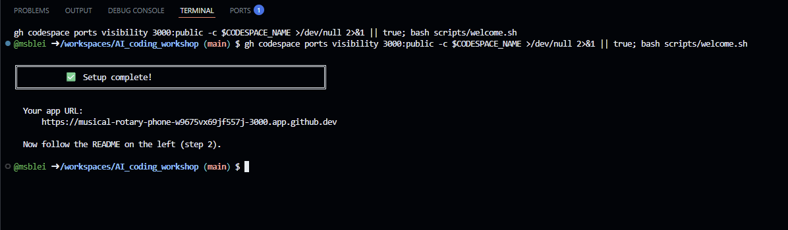
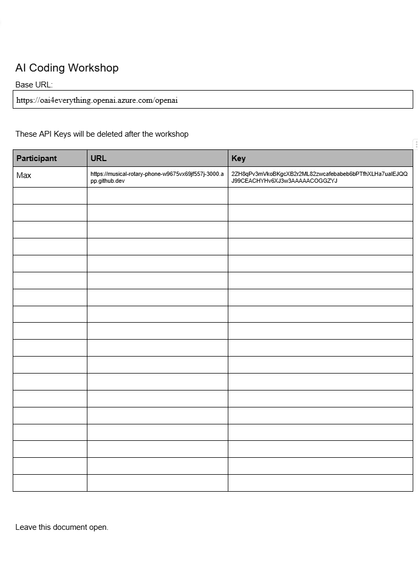
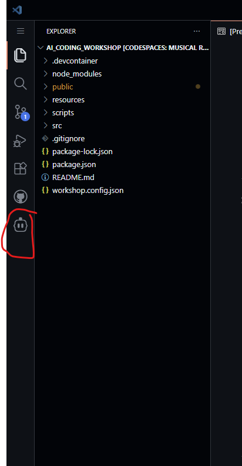
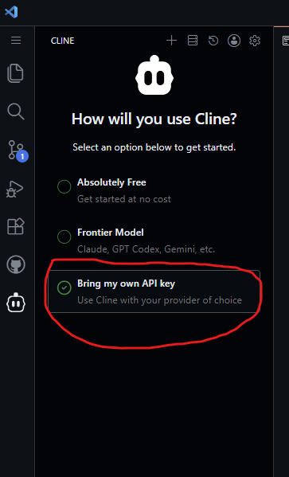
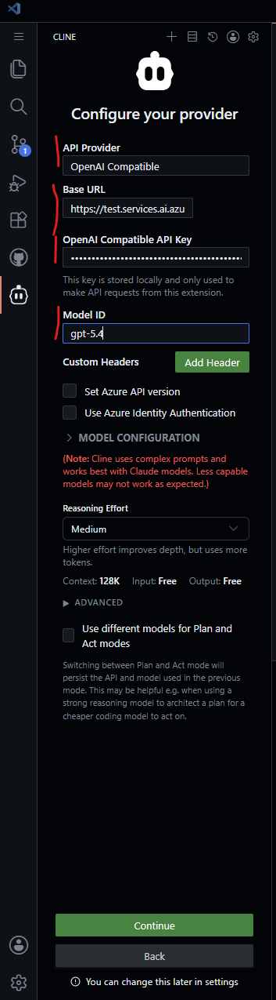
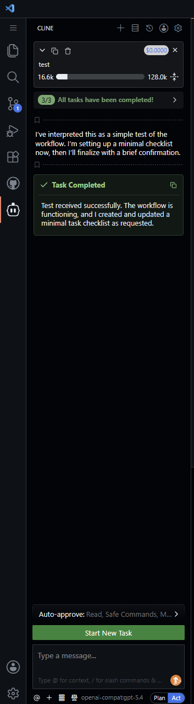
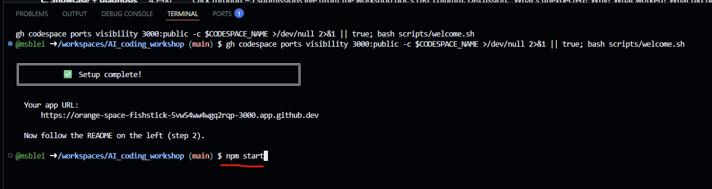
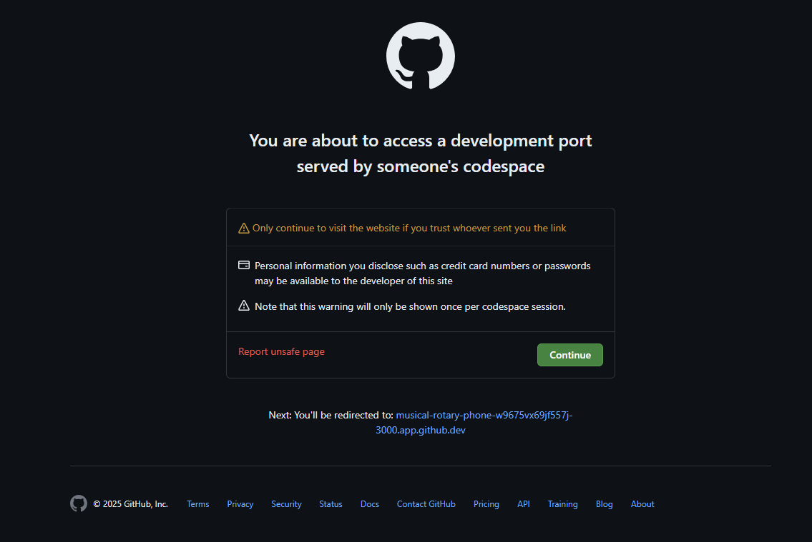

# AI Coding Workshop

---

## Instructions for participants

Welcome! There are **three setup steps**. If you are stuck at any, please raise your hand.

---

### Step 1: Open the codespace

1. Click the badge below. Ctrl + click to open in a new window.

   <a href="https://codespaces.new/msblei/AI_coding_workshop?quickstart=1" target="_blank">
     
   </a>

2. Sign in to GitHub if asked. On the next page, click **"Create new codespace"**.

   

3. **Wait up to 5 minutes** for setup to finish. You'll know it's done when a welcome banner appears in the **terminal at the bottom of the screen**.

   

---

### Step 2: Set up your AI coding assistant

1. Open the workshop document:

   **[Workshop document](https://docs.google.com/document/d/1cgWG_Foie4dn7LOJ9J-9Qep2sB2R1cD0maejTJbVMjY/edit?usp=sharing)**

2. Find the row with your name in the document.
   - **Paste your app URL** (from the welcome banner in step 1) into your row.
   - Leave the document open as you will need to copy both the Base URL and the API key later on.

   

3. Back in the codespace, click the **robot icon** on the left sidebar. A panel opens.

   

   Select "Bring my own API Key"

   

   Add the following information:

   API Provider: `OpenAI Compatible`

   Base URL: From the Google Doc before

   OpenAI Compatible API Key: From the Google Doc before

   Model ID: `gpt-5.4`

   

   Click "Continue".

4. In the Cline chat box, send any message:

   E.g.

   > Hello! Say hi back so I know you're working.

5. Wait a few seconds for Cline to reply.

   

---

### Step 3: Start the app

1. Switch to the terminal in the bottom again.

2. In the terminal, type the following and press Enter:

   ```
   npm start
   ```

   

3. Wait until you see **"Compiled successfully!"** below it — about 30 seconds.

4. Click your app URL (or copy-paste it into a new browser tab). If you see a security warning, click "Continue".

   

The page should say **"Everything works!"**.

5. Wait for further instructions.

---

---

## Instructions for instructors

Everything below this line is for the people running the workshop.

### Workshop flow (120 min)

| Block                       | Time    | Activity                                                                                                                                                                                                                                  |
| --------------------------- | ------- | ----------------------------------------------------------------------------------------------------------------------------------------------------------------------------------------------------------------------------------------- |
| **A. Setup**                | 0–15    | Participants work through the three checkpoint steps in this README. Make sure everyone arrives at Checkpoint 3 ("Everything works!") before moving on.                                                                                   |
| **B. Vibe round**           | 15–45   | Intro to Cline's Plan/Act toggle (set to **Act** for this round). Suggested Exercise 1 prompt see below. Participants iterate freely. Expected: working apps, but sometimes unexpected behaviour.                                         |
| **C. Showcase + diagnosis** | 45–60   | Click through ~5 submissions live (from the workshop doc's URL column). Discussion: "What's unexpected? Why? What worked? What did not?" Land the takeaway: vibe coding produces _something_ but structure rots fast as features pile on. |
| **D. Spec-driven intro**    | 60–75   | Live demo. Switch Cline to **Plan mode**. Run the suggested Exercise 2 spec prompt. Narrate: "no code yet, just a plan we can argue with." Refine the plan with 2–3 follow-ups. Then flip to Act. Optional: run `npm run reset-app`       |
| **E. Build round**          | 75–110  | Participants run their own plan→act cycle. Float around.                                                                                                                                                                                  |
| **F. Showcase + wrap**      | 110–120 | Click through again. Side-by-side: vibe round vs spec round. Q&A.                                                                                                                                                                         |

### Exercise 1 prompt (Act mode, on slide)

> Build me a flashcard study app in this React project. I should be able to flip cards and go to the next one.

This intentionally yields _something_. Failure modes participants discover fast: no add/edit, no persistence, no "got it / review again", one deck only, no progress indicator. Use those failures as the motivation for Exercise 2.

### Exercise 2 prompt (Plan mode, hand out after the spec-driven intro)

> I want a flashcard study app. Users create multiple decks, each with cards (front/back text). In study mode, they review a deck one card at a time, flip to see the answer, then mark "got it" or "review again". Cards marked "review again" come back in the same session. Make everything a single page React app, no other components needed.

The visible artifacts under `cline_plan/` (architecture.md, todo.md, ticked checkboxes) are the wow moment — participants watch the agent "organize itself". The `.clinerules` file enforces the folder convention so the planning files don't scatter at the repo root.

### One-time setup before each workshop

Before the workshop API keys for whichever model need to be provided. Keep in mind that rate limits apply, e.g. at most 1M tokens per key on Azure OpenAI service. Hence creating multiple keys might be necessary.

---

## What's actually running

This is a Create React App project. `npm start` runs the dev server on port 3000 (via the `scripts/start.sh` wrapper that prints the URL first). The devcontainer forwards port 3000 publicly so anyone with the codespace URL can view it.

The starter `src/App.js` renders "Everything works!" — visible confirmation of Checkpoint 3 and a neutral starting point so the LLM doesn't anchor on prior code when participants give it a one-line prompt.
