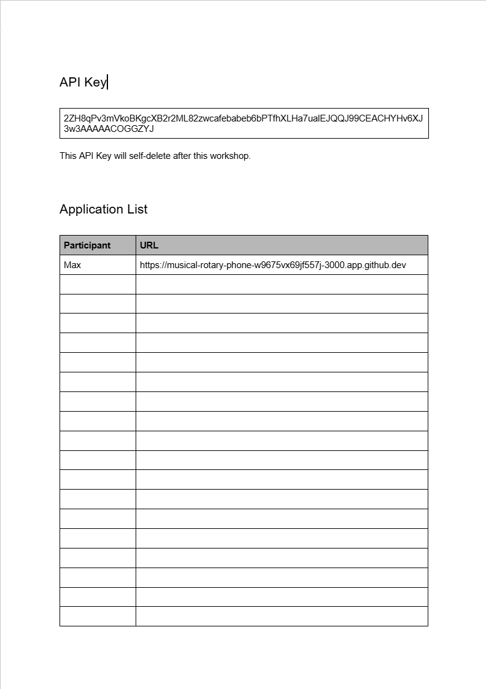

# AI Coding Workshop

---

## Instructions for participants

Welcome! There are **three setup steps**. After each one, you should see a ✅ checkpoint. If you don't see it, raise your hand.

---

### Step 1: Open the codespace

1. Click the badge below.

   <a href="https://codespaces.new/msblei/AI_coding_workshop?quickstart=1" target="_blank">
     
   </a>

2. Sign in to GitHub if asked. On the next page, click **"Create new codespace"**.

   

3. **Wait up to 5 minutes** for setup to finish. You'll know it's done when a welcome banner appears in the **terminal at the bottom of the screen**.

   

---

### Step 2: Set up your API key

1. Open the workshop document:

   👉 **[Workshop document](https://docs.google.com/document/d/1cgWG_Foie4dn7LOJ9J-9Qep2sB2R1cD0maejTJbVMjY/edit?usp=sharing)**

2. Find the row with your name in the document.
   - **Paste your app URL** (from the welcome banner in step 1) into your row.
   - **Copy your API key** from your row — you'll need it next.

   

3. Back in the codespace, click the **robot icon** on the left sidebar. A panel opens. Paste your API key into the box and click **Save**.

   

   

4. In the Cline chat box, send this message:

   > Hello! Say hi back so I know you're working.

5. Wait a few seconds for Cline to reply.

   

---

### Step 3: Start the app

1. Open a new terminal. At the top of the screen, click **Terminal → New Terminal**.

2. In the terminal, type the following and press Enter:

   ```
   npm start
   ```

3. A banner prints with your app URL and an arrow (👉). Wait until you see **"Compiled successfully!"** below it — about 30 seconds.

4. Click your app URL (or copy-paste it into a new browser tab). The page should say **"✅ Everything works!"**.

   

---

## Instructions for instructors

Everything below this line is for the people running the workshop.

> **Workshop document URL** lives in **step 2** of the participant section above. That is the single source of truth — edit it there per workshop run. Nothing else references it.

### Repo layout

| File / dir                        | Purpose                                                                                                                                                                                                                                                                    |
| --------------------------------- | -------------------------------------------------------------------------------------------------------------------------------------------------------------------------------------------------------------------------------------------------------------------------- |
| `workshop.config.json`            | Single source of truth for LiteLLM base URL and model. Edit per workshop instance.                                                                                                                                                                                         |
| `.devcontainer/devcontainer.json` | Preinstalls Cline, installs `jq`, runs the seed + welcome scripts.                                                                                                                                                                                                         |
| `scripts/seed-cline-settings.sh`  | On `postCreate`, reads `workshop.config.json` and writes `.vscode/settings.json` so Cline opens pre-pointed at your LiteLLM proxy.                                                                                                                                         |
| `scripts/welcome.sh`              | Terminal banner on every attach. Checkpoint 1 for participants — prints app URL and "Setup complete!" Nothing more.                                                                                                                                                        |
| `scripts/start.sh`                | What `npm start` calls. Prints the codespace URL prominently with an arrow, then execs `react-scripts start`. Replaces the auto-task approach (which got blocked by VS Code's trusted-workspaces prompt).                                                                  |
| `scripts/reset-app.sh`            | What `npm run reset-app` calls. Restores `src/App.js` and `src/App.css` to the "Everything works!" starter (inlined in the script), removes any `architecture.md` / `todo.md` leftover, and re-applies the browser tab title.                                              |
| `scripts/set-title.sh`            | Sets `<title>` in `public/index.html` to the participant's name so each browser tab in the showcase grid is labeled. Runs on `postCreate`. Falls back through `$WORKSHOP_PARTICIPANT_NAME` → `git config user.name` → `$GITHUB_USER` → `$CODESPACE_NAME` → "Workshop App". |
| `scripts/mint-keys.sh`            | **Organizer-only.** Mints N LiteLLM virtual keys from a `participants.txt` list. Prints CSV ready to paste into the workshop document.                                                                                                                                     |

### Workshop flow (120 min)

| Block                       | Time    | Activity                                                                                                                                                                                                                                                                       |
| --------------------------- | ------- | ------------------------------------------------------------------------------------------------------------------------------------------------------------------------------------------------------------------------------------------------------------------------------ |
| **A. Setup**                | 0–15    | "Click the badge" slide. Participants work through the three checkpoint steps in the README. Everyone arrives at Checkpoint 3 ("Everything works!") before moving on.                                                                                                          |
| **B. Vibe round**           | 15–45   | Slide intro to Cline's Plan/Act toggle (set to **Act** for this round). Hand out Exercise 1 prompt — see below. Participants iterate freely. Expected: messy half-working apps.                                                                                                |
| **C. Showcase + diagnosis** | 45–60   | Click through 5–8 submissions live (from the workshop doc's URL column). Discussion: "What's broken? Why?" Land the takeaway: vibe coding produces _something_ but structure rots fast as features pile on.                                                                    |
| **D. Spec-driven intro**    | 60–75   | Slide + live demo. Either spin up a fresh Codespace or have participants run `npm run reset-app`. Switch Cline to **Plan mode**. Run the Exercise 2 spec prompt. Narrate: "no code yet, just a plan we can argue with." Refine the plan with 2–3 follow-ups. Then flip to Act. |
| **E. Build round**          | 75–110  | Participants run their own plan→act cycle. Float around.                                                                                                                                                                                                                       |
| **F. Showcase + wrap**      | 110–120 | Click through again. Side-by-side: vibe round vs spec round. Q&A.                                                                                                                                                                                                              |

### Exercise 1 prompt (Act mode, on slide)

> Build me a flashcard study app in this React project. I should be able to flip cards and go to the next one.

This intentionally yields _something_. Failure modes participants discover fast: no add/edit, no persistence, no "got it / review again", one deck only, no progress indicator. Use those failures as the motivation for Exercise 2.

### Exercise 2 prompt (Plan mode, hand out after the spec-driven intro)

> I want a flashcard study app. Users create multiple decks, each with cards (front/back text). In study mode, they review a deck one card at a time, flip to see the answer, then mark "got it" or "review again". Cards marked "review again" come back in the same session. Everything persists in localStorage. Single-page React app, no backend.
>
> Before writing any code:
>
> 1. Write `architecture.md` covering the data model (TypeScript-style interfaces), the component tree, the state-flow between screens, and the localStorage schema. Use Mermaid diagrams where they help.
> 2. Write `todo.md` as a checklist of implementation steps, ordered so each step leaves the app in a runnable state.
> 3. Pause and show me both files before you proceed.
>
> After I approve, implement step-by-step. Update `todo.md` by checking off each item as you finish it. If you discover a planning gap mid-implementation, edit `architecture.md` and call out the change.

The visible artifacts (architecture.md, todo.md, ticked checkboxes) are the wow moment — participants watch the agent "organize itself".

### One-time setup before each workshop

1. **Create the workshop document.** A Google Doc set to "Anyone with the link can edit". Layout it as a 3-column table: `Name | API Key | App URL`. Pre-fill the Name column with participants. Leave API Key and App URL columns empty for now.

2. **Paste the doc URL into step 2 of the participant section above** (the `[Workshop document](...)` link). One commit per workshop run.

3. **Edit `workshop.config.json`**:
   - `litellmBaseUrl`: your LiteLLM proxy, with the `/anthropic` suffix (e.g. `https://litellm.example.com/anthropic`).
   - `model`: e.g. `claude-sonnet-4-6` or `claude-opus-4-7`.

4. **Stand up LiteLLM** with one upstream Anthropic or Azure AI Foundry key. The upstream key's **tier** is the load-bearing detail: ~20 participants doing agentic coding simultaneously needs roughly Anthropic Tier 4 (or equivalent Foundry provisioned throughput). Anything lower and people get throttled mid-prompt.

5. **Mint keys** the morning of:

   ```
   LITELLM_URL=https://litellm.example.com \
   LITELLM_ADMIN_KEY=sk-admin-... \
   ./scripts/mint-keys.sh participants.txt
   ```

   `participants.txt` is one name per line. The script prints a CSV of `name,key`. Paste this into the workshop document's Name and API Key columns.

### Dry-run checklist before announcing

- [ ] Open a fresh Codespace. Confirm the welcome banner with the live URL appears in the integrated terminal once setup finishes. **No "automatic tasks" prompt should appear anywhere in the flow.** (Checkpoint 1.)
- [ ] Paste a freshly-minted virtual key into Cline. Confirm `.vscode/settings.json` already has the LiteLLM base URL and model filled in (`cat .vscode/settings.json`). Send the "say hi back" message — confirm Cline replies. (Checkpoint 2.)
- [ ] Open a new terminal, run `npm start`. Confirm the wrapper banner shows the URL with an arrow. Wait for "Compiled successfully!". Open the URL — confirm "✅ Everything works!" renders. (Checkpoint 3.)
- [ ] Run Exercise 1 in Act mode end-to-end. Confirm the app updates live as Cline edits files. Time it.
- [ ] Paste the live URL into the workshop document's App URL column. Open it from an incognito browser with no GitHub session — confirm it's reachable.
- [ ] `npm run reset-app`. Confirm `src/App.js` is back to "Everything works!" and any old `architecture.md` / `todo.md` is gone.
- [ ] Run Exercise 2 in Plan mode. Confirm Cline writes `architecture.md` and `todo.md`, pauses, then ticks items off in Act.
- [ ] Fire 5 simultaneous Exercise 1 runs from 5 codespaces. Watch the LiteLLM dashboard for rate-limit errors. Scale upstream tier _before_ the workshop, not during.
- [ ] Test key revocation: revoke a virtual key mid-conversation in Cline, confirm a clear error (not a silent hang).

### Failure modes to expect during the vibe round

| Symptom                                                         | What participants experience                  | What to say                                                 |
| --------------------------------------------------------------- | --------------------------------------------- | ----------------------------------------------------------- |
| App crashes on hot-reload after Cline edits multiple files      | Blank screen, console errors                  | "Refresh the tab. This is one reason planning matters."     |
| Cline burns 10k tokens generating a single mega-prompt          | Slow, sometimes hangs at end of round         | "We'll come back to why spec mode is cheaper too."          |
| The "flashcard app" ends up as one static deck with no add/edit | Demo looks fine but isn't really a study tool | This is the point of the round. Land it in the showcase.    |
| Participant accidentally clicks "Plan mode" in round B          | Cline doesn't write code                      | Show them the toggle. Briefly tease "we'll use that later". |

### Future-you considerations

- **Cline's settings keys may change.** If `cline.apiProvider` / `cline.anthropicBaseUrl` / `cline.modelId` stop being honored, re-check the extension's `package.json` contributions on the marketplace. The seed script will write whatever keys you give it — the schema is the load-bearing piece.
- **Switching providers later** (OpenRouter, raw Foundry, direct Anthropic): only `workshop.config.json` needs to change. The devcontainer + scripts are provider-agnostic.

---

## What's actually running

This is a Create React App project. `npm start` runs the dev server on port 3000 (via the `scripts/start.sh` wrapper that prints the URL first). The devcontainer forwards port 3000 publicly so anyone with the codespace URL can view it.

The starter `src/App.js` renders "✅ Everything works!" — visible confirmation of Checkpoint 3 and a neutral starting point so the LLM doesn't anchor on prior code when participants give it a one-line prompt.
