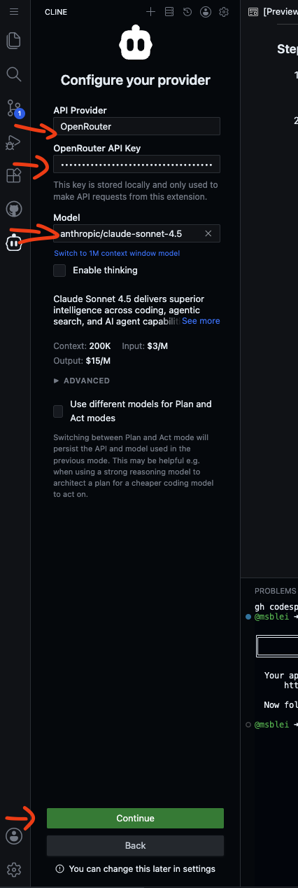

# AI Coding Workshop

A hands-on workshop where participants build a small React app with the **Cline** AI coding
assistant — first by "vibe coding", then with a spec-driven plan→act flow.

## Two ways to run this workshop

| Mode | Who opens what | Guide |
|------|----------------|-------|
| **GitHub Codespaces** | Participants click the badge below and a browser VS Code spins up. | This file (below). |
| **Self-hosted** (code-server) | Organizer runs a fleet of browser IDEs on one VM; participants claim a spot from a landing page. | [`deploy/README.md`](deploy/README.md) |

> Organizers: the self-hosted path exists for networks where Codespaces is blocked (its tunnel
> transport is often filtered by corporate proxies). See [`deploy/README.md`](deploy/README.md).

---

## Instructions for participants (Codespaces)

Welcome! There are **three steps**. If you get stuck on any, please raise your hand.

### Step 1: Open the codespace

1. Click the badge below (Ctrl/Cmd-click to open in a new tab):

   <a href="https://codespaces.new/msblei/AI_coding_workshop?quickstart=1" target="_blank">
     
   </a>

2. Sign in to GitHub if asked, then click **"Create new codespace"**.

   

3. **Wait up to 5 minutes** for setup. It's ready when a welcome banner appears in the **terminal**
   at the bottom of the screen.

   

### Step 2: Set up Cline (OpenRouter)

<!-- This section is identical to the self-hosted guide in deploy/README-workspace.md.
     If you change it here, change it there too. -->
1. Copy your **OpenRouter API key** (find it in the workshop document next to your name).


   https://docs.google.com/document/d/1cgWG_Foie4dn7LOJ9J-9Qep2sB2R1cD0maejTJbVMjY/edit?tab=t.0

   

   (Fake key in this screenshot)

2. Click the **Cline robot icon** in the left sidebar. A panel opens.

   


3. Choose **"Use your own API key"**, then set **API Provider** to **OpenRouter**.

   <!-- TODO screenshot: Cline API Provider dropdown set to "OpenRouter" -> resources/cline_openrouter_provider.png -->
   


4. Set the **Model** to `anthropic/claude-sonnet-4`, then save.

   <!-- TODO screenshot: Cline OpenRouter key + model filled in -> resources/cline_openrouter_config.png -->
   

5. In the Cline chat box, send any message (e.g. *"Hello! Say hi back so I know you're working."*)
   and wait a few seconds for a reply.

   

### Step 3: Start the app

1. In the terminal at the bottom, type and press Enter:

   ```
   npm start
   ```

   

2. Wait for **"Compiled successfully!"** (about 30 seconds).

3. Click your app URL (from the welcome banner). If you see a security warning, click **"Continue"**.

   

   The page should say **"Everything works!"**. Now wait for instructions.

---

## Instructions for instructors

Everything below is for the people running the workshop.

### Workshop flow (120 min)

| Block | Time | Activity |
| ----- | ---- | -------- |
| **A. Setup** | 0–15 | Participants work through the three steps above. Make sure everyone reaches "Everything works!" before moving on. |
| **B. Vibe round** | 15–45 | Intro Cline's Plan/Act toggle (set to **Act**). Use Exercise 1 below. Participants iterate freely — working apps, but often unexpected behaviour. |
| **C. Showcase + diagnosis** | 45–60 | Click through ~5 submissions live. Discussion: "What's unexpected? Why?" Takeaway: vibe coding produces _something_, but structure rots as features pile on. |
| **D. Spec-driven intro** | 60–75 | Live demo. Switch Cline to **Plan mode**. Run Exercise 2's spec prompt. Narrate: "no code yet, just a plan we can argue with." Refine, then flip to Act. Optional: `npm run reset-app`. |
| **E. Build round** | 75–110 | Participants run their own plan→act cycle. Float around. |
| **F. Showcase + wrap** | 110–120 | Click through again. Side-by-side: vibe round vs spec round. Q&A. |

### Exercise 1 prompt (Act mode, on slide)

> Build me a flashcard study app in this React project. I should be able to flip cards and go to the next one.

This intentionally yields _something_. Failure modes participants find fast: no add/edit, no
persistence, no "got it / review again", one deck only, no progress indicator — motivation for Exercise 2.

### Exercise 2 prompt (Plan mode, hand out after the spec-driven intro)

> I want a flashcard study app. Users create multiple decks, each with cards (front/back text). In study
> mode, they review a deck one card at a time, flip to see the answer, then mark "got it" or "review
> again". Cards marked "review again" come back in the same session. Make everything a single page React
> app, no other components needed.

The visible artifacts under `cline_plan/` (architecture.md, todo.md, ticked checkboxes) are the wow
moment — participants watch the agent organize itself. The `.clinerules` file enforces that folder
convention so planning files don't scatter at the repo root.

### Before each workshop

- Provide OpenRouter API key(s) for participants (a credit limit per key is wise). Put them in the
  workshop document next to each participant's name.
- This is a Create React App project. `npm start` runs the dev server on port 3000 (via
  `scripts/start.sh`, which prints the URL first). The starter `src/App.js` renders "Everything works!"
  — a neutral starting point so the model doesn't anchor on prior code.
- For the **self-hosted** path (firewalled networks, no per-participant GitHub needed), see
  [`deploy/README.md`](deploy/README.md).
